# Flows — 도메인별 사용자 플로우

> **목적**: PRD 4-2의 9개 영역(F1~F9)을 사용자 시점의 플로우로 시각화. 화면 사양(`screens.md`)과 프로토타입(`prototype/`)이 어떤 사용자 여정을 구현하는지 한눈에 보이게 한다.
>
> **범례**:
> - `SCR-XXX` = `screens.md`의 화면 ID (cross-reference)
> - sequence diagram = 시간축 + 행위자 간 상호작용 (서버 호출이 핵심인 경우)
> - flowchart = 의사결정 분기 (사용자 선택지가 핵심인 경우)

---

## 1. 인증 + Deferred Auth (F1)

### 1-1. 첫 진입 + Deferred Auth

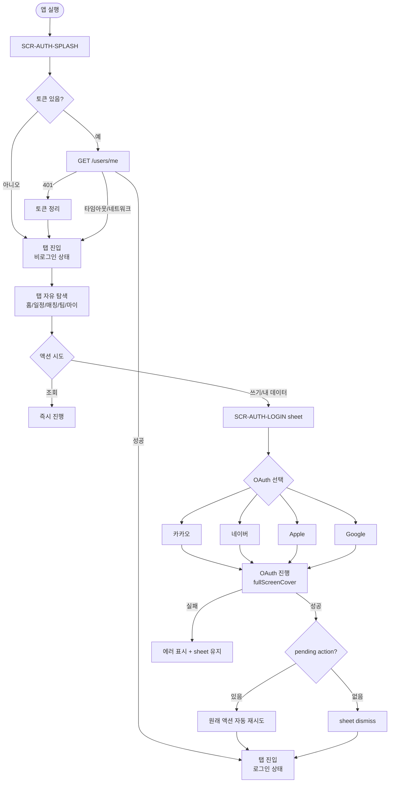

### 1-2. 온보딩 (최초 가입)

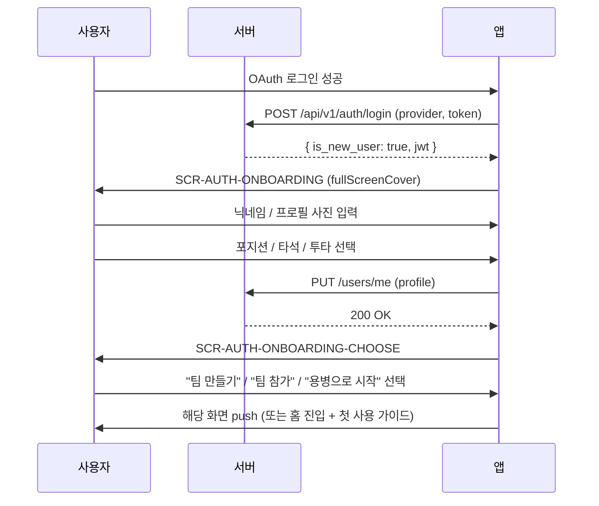

### 1-3. 로그아웃

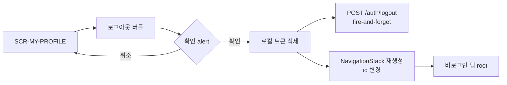

---

## 2. 팀 (F2)

### 2-1. 팀 생성

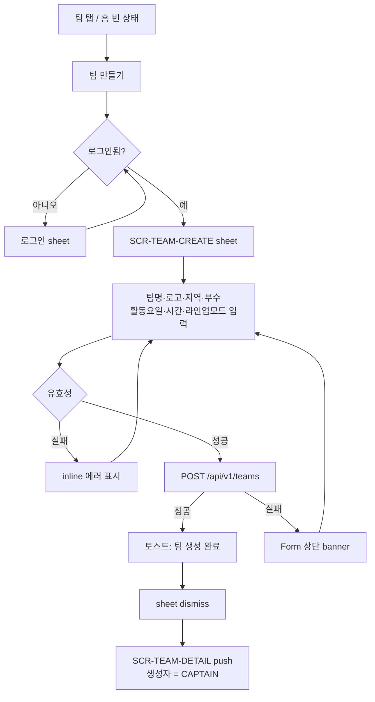

### 2-2. 팀 가입 (초대 코드)

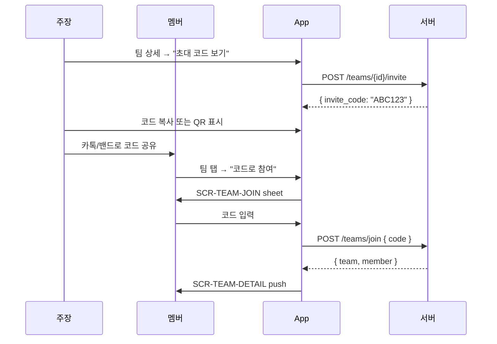

### 2-3. 멤버 관리 (역할 변경 / 추방)

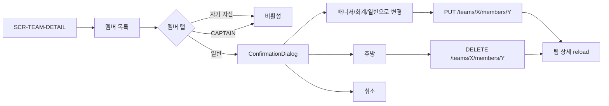

---

## 3. 경기 일정 (F3 — 일정 부분)

### 3-1. 경기 등록

```mermaid
flowchart TD
    Entry[일정 탭 + 또는<br/>팀 상세 → 경기 등록] --> Auth{권한}
    Auth -->|MEMBER| Hidden[버튼 숨김]
    Auth -->|CAPTAIN/MANAGER| Sheet[SCR-MATCH-CREATE sheet]
    Sheet --> Form[날짜/경기시간/집합시간<br/>구장 선택/직접입력<br/>상대팀(선택)<br/>투표마감시간(선택)<br/>메모]
    Form --> Submit
    Submit --> API[POST /teams/X/matches]
    API -->|성공| Toast[경기 등록 완료]
    Toast --> Dismiss[dismiss]
    Dismiss --> Reload[일정 캘린더 reload]
    Note1[멤버 알림 발송<br/>v0.5+ FCM/카카오] -.-> API
```

### 3-2. 경기 수정·취소

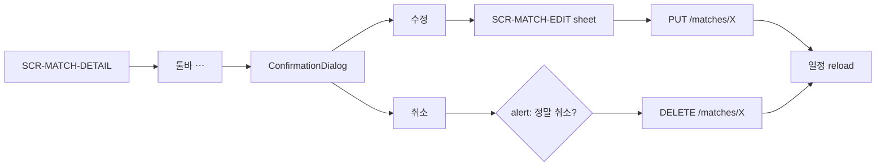

---

## 4. 출석 투표 (F3 — 출석 부분)

### 4-1. 멤버 시점 (투표하기)

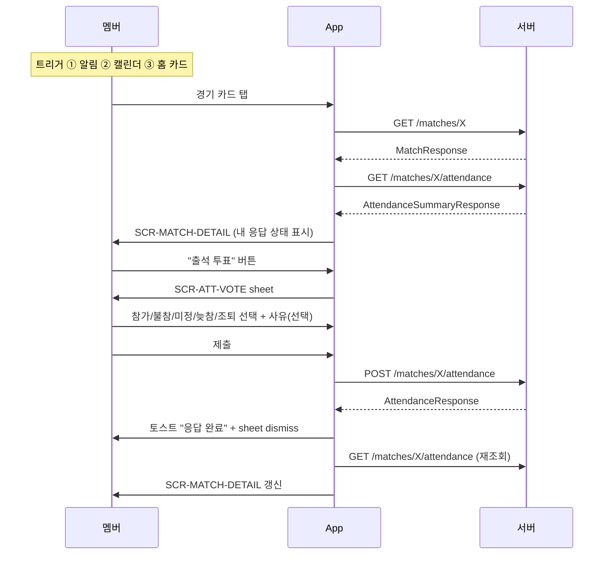

### 4-2. 주장 시점 (현황 확인)

```mermaid
flowchart TD
    Detail[SCR-MATCH-DETAIL] --> Section[출석 현황 섹션]
    Section --> Counts[참가 N / 불참 N / 미정 N<br/>늦참 N / 조퇴 N / 미응답 N]
    Section --> Predict{AI 출석 예측<br/>v0.5+}
    Predict -->|있음| Show["예상 14~16명<br/>김OO 90% 참가 예상"]
    Section --> Tap["전체 보기"]
    Tap --> Summary[SCR-ATT-SUMMARY push]
    Summary --> List[멤버별 응답 + 사유 + 시간]
    List --> Risk{예상 9명 미만?}
    Risk -->|예| Banner[경고 배너<br/>"용병 모집 추천"]
    Banner --> RecruitBtn[용병 모집 버튼<br/>v1.0+]
```

---

## 5. 라인업 (F4 — v0.5 Beta)

```mermaid
flowchart TD
    Detail[SCR-MATCH-DETAIL] --> Section[라인업 섹션]
    Section --> Status{라인업 상태}
    Status -->|미생성| Empty[빈 상태 + "AI 추천" 버튼]
    Status -->|초안| Draft[현재 라인업 미리보기 + "편집"]
    Status -->|확정| Confirmed[라인업 카드 이미지]

    Empty --> RecBtn[AI 추천 버튼]
    RecBtn --> ApiR[POST /matches/X/lineup/recommend]
    ApiR -->|3초 이내| Result[추천 결과]
    Result --> Edit[SCR-LINEUP-EDIT push]

    Edit --> Diamond[야구장 다이아몬드 뷰]
    Diamond --> DragDrop[드래그&드롭으로<br/>포지션·타순 수정]
    Edit --> Save[저장] --> ApiS[POST/PUT /matches/X/lineup]
    Edit --> Confirm[확정]
    Confirm --> Alert{alert: 확정 시 멤버에게<br/>알림 발송됨}
    Alert -->|확인| ApiC[POST /matches/X/lineup/confirm]
    ApiC --> CardGen[카드 이미지 생성<br/>GET /lineup/card]
    CardGen --> Notify[전 멤버 푸시 + 알림톡]
    Notify --> Share["카카오톡 공유" 액션]
```

---

## 6. 회비 (F5 — v0.5 Beta)

### 6-1. 회비 생성·납부

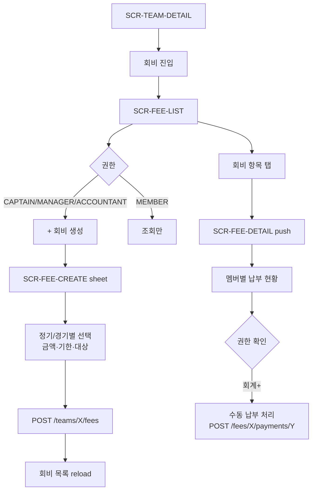

### 6-2. 미납 리마인더 (자동)

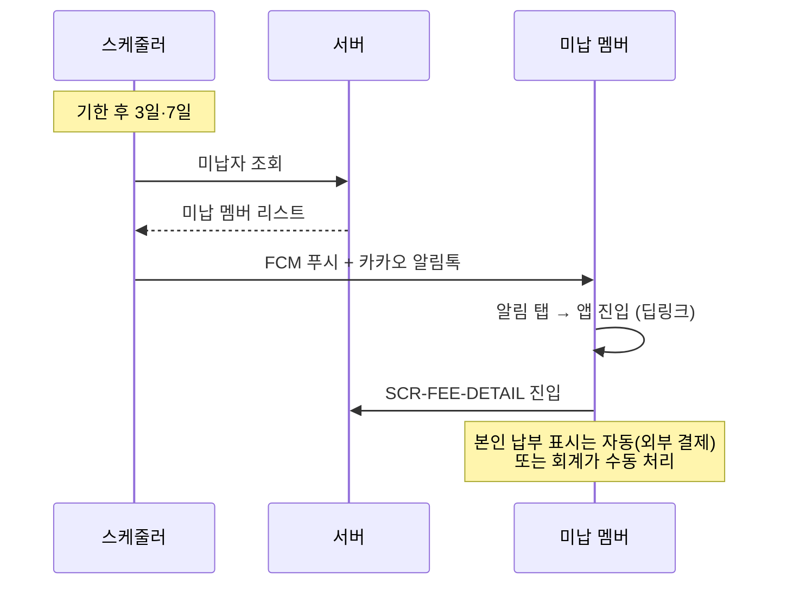

---

## 7. 팀 매칭 (F6 — v1.0)

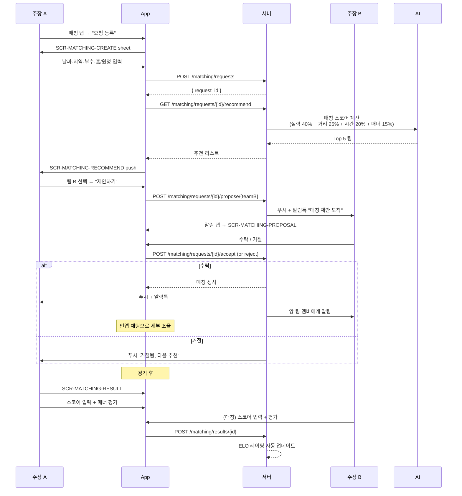

---

## 8. 용병 매칭 (F7 — v1.0)

### 8-1. 팀 → 용병 모집

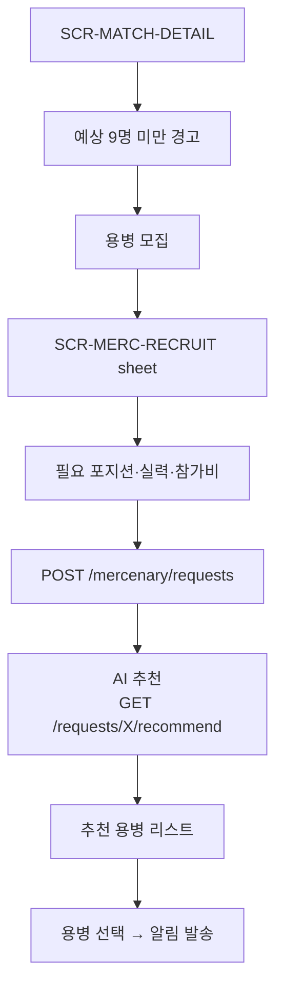

### 8-2. 용병 → 지원

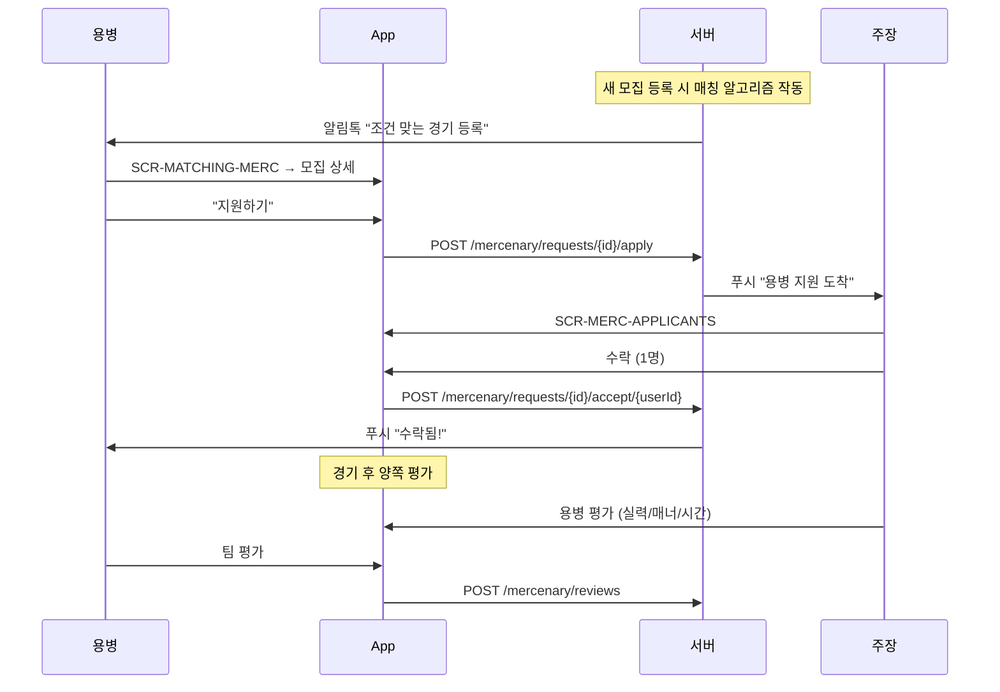

---

## 9. 알림 진입 (F9 — 횡단)

```mermaid
flowchart TD
    Channel{알림 채널} --> Push[FCM 푸시]
    Channel --> Talk[카카오 알림톡]
    Channel --> Email[이메일]

    Push --> Tap[알림 탭]
    Talk --> Link[딥링크 탭]

    Tap & Link --> Auth{앱 설치 + 로그인}
    Auth -->|미설치| Store[App Store / Play Store]
    Auth -->|미로그인| LoginSheet[로그인 sheet] --> Auth
    Auth -->|OK| Route[딥링크 라우팅]

    Route --> NewMatch["새 경기"<br/>→ SCR-MATCH-DETAIL]
    Route --> AttendRemind["출석 리마인드"<br/>→ SCR-ATT-VOTE]
    Route --> LineupConfirmed["라인업 확정"<br/>→ SCR-LINEUP-VIEW]
    Route --> FeeBill["회비 청구"<br/>→ SCR-FEE-DETAIL]
    Route --> MatchProposal["매칭 제안"<br/>→ SCR-MATCHING-PROPOSAL]
    Route --> MercRecommend["용병 추천"<br/>→ SCR-MATCHING-MERC"]

    InApp[앱 내 헤더 🔔] --> Center[SCR-NOTIF-CENTER sheet]
    Center --> Tap2[알림 항목 탭] --> Route
```

**알림 채널별 발송 매트릭스 (PRD 4-2 F9-2 그대로):**

| 알림 유형 | 시점 | 푸시 | 알림톡 | 딥링크 → |
|---------|------|:-:|:-:|----------|
| 새 경기 일정 | 등록 즉시 | ✅ | ✅ | SCR-MATCH-DETAIL |
| 출석 리마인드 | 48h, 24h 전 | ✅ | ✅ (24h) | SCR-ATT-VOTE |
| 라인업 확정 | 주장 확정 시 | ✅ | ✅ | SCR-LINEUP-VIEW |
| 라인업 변경 | 변경 시 | ✅ | ❌ | SCR-LINEUP-VIEW |
| 회비 청구 | 청구일 | ✅ | ✅ | SCR-FEE-DETAIL |
| 회비 미납 리마인드 | 기한 후 3·7일 | ✅ | ✅ | SCR-FEE-DETAIL |
| 매칭 요청 수신 | 요청 시 | ✅ | ✅ | SCR-MATCHING-PROPOSAL |
| 매칭 성사 | 성사 시 | ✅ | ✅ | SCR-MATCHING-DETAIL |
| 용병 추천 | 조건 맞는 경기 | ✅ | ❌ | SCR-MATCHING-MERC |

---

## 10. 횡단 — 한 사용자, 여러 팀

PRD F1-6: "여러 팀 소속 지원". 다음 화면들은 "팀 컨텍스트" 명시가 필수:

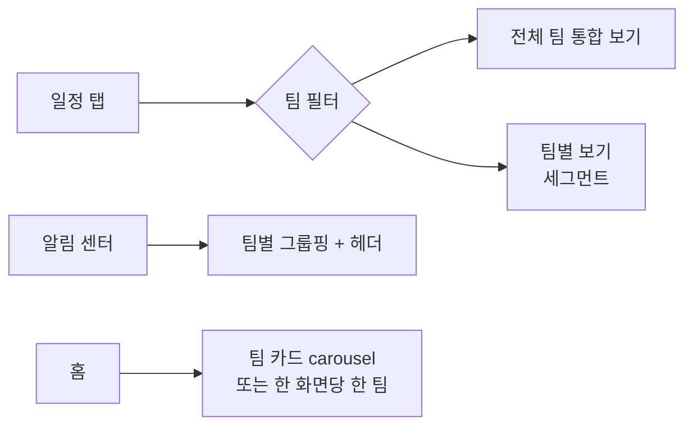

- 일정 탭은 기본 "전체 통합", 필터로 팀별 전환
- 알림은 팀별 그룹헤더 (예: "수원 라이거스 — 출석 리마인드 3건")
- 팀 컨텍스트가 핵심인 화면(라인업·회비·멤버)은 navigation bar에 팀명 노출 (`title="라이거스 · 라인업"` 형태)
