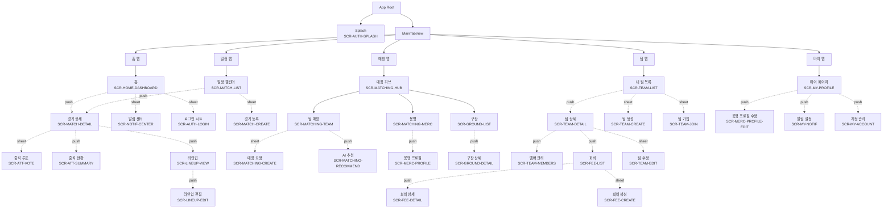

# IA — 정보 구조 · 네비게이션 · 권한 · 상태 표준

> **목적**: Dugout 앱의 최상위 의사결정을 한 문서에 모아, 모든 화면 사양(`screens.md`)·플로우(`flows.md`)·프로토타입(`prototype/`)이 일관된 베이스라인을 따르게 한다.
>
> **범위**: PRD/TDD v1.0까지의 9개 영역(인증·팀·경기·출석·라인업·회비·매칭·용병·구장+알림). 현재 iOS 구현은 참고만 하고 구속받지 않는다.

---

## 1. 탭 구조 (Bottom Tab Bar)

### 1-1. 후보 비교

PRD 4-1은 **홈 / 일정 / 매칭 / 팀 관리 / 알림 / 마이페이지**의 6영역을 제시한다. iOS Tab Bar는 5개를 권고선으로 보고, 알림은 푸시·헤더 진입이 표준이라는 점을 반영해 4가지 후보를 비교했다.

| 후보 | 탭 구성 | 알림 진입 | 장점 | 단점 |
|------|--------|----------|------|------|
| A. PRD 그대로 6탭 | 홈/일정/매칭/팀/알림/마이 | 알림 탭 | PRD 충실 | iOS 가이드 위반(More 메뉴 강제), 학습성 ↓ |
| B. 5탭 (알림 제외) | 홈/일정/매칭/팀/마이 | 별도 진입 없음 | iOS 표준 준수 | 알림 센터 접근성 ↓ |
| **C. 5탭 + 헤더 종 아이콘** ✅ | 홈/일정/매칭/팀/마이 | 모든 탭 헤더의 🔔 → 모달 sheet | iOS 표준 준수 + 알림 항상 1탭 | 종 아이콘 위치 일관성 유지 필요 |
| D. 4탭 (팀 통합) | 홈/일정/매칭/마이 | 헤더 종 아이콘 | 단순 | 팀 관리 깊이가 묻힘 (회비·멤버·설정) |

### 1-2. 채택안 — 후보 C

```
┌─────────────────────────────────────────────────────┐
│ 홈     │ 일정    │ 매칭    │ 팀      │ 마이      │
│ 🏠     │ 📅      │ 🤝      │ ⚾      │ 👤        │
└─────────────────────────────────────────────────────┘
```

| 탭 | SF Symbol | root 콘텐츠 | 비로그인 동작 |
|----|-----------|------------|--------------|
| **홈** | `house` | 다음 경기 카드, AI 인사이트, 팀 공지 요약 | 비로그인 빈 상태 + 로그인 시트 트리거 |
| **일정** | `calendar` | 캘린더 + 경기 목록 (속한 모든 팀 통합) | 비로그인 빈 상태 |
| **매칭** | `figure.2.arms.open` | 연습경기 매칭 / 용병 / 구장 (세그먼트 컨트롤) | 진입 가능, 액션 시 로그인 트리거 |
| **팀** | `person.3.fill` | 내 팀 목록 → 팀 상세 (멤버·회비·설정) | 비로그인 빈 상태 |
| **마이** | `person.crop.circle` | 프로필, 용병 프로필, 알림 설정, 로그아웃 | 비로그인 분기 + 로그인 진입 |

**알림 진입**: 모든 탭 root 화면의 navigation bar 우측 상단 🔔 (badge with unread count) → `.sheet`로 알림 센터 표시. 탭바를 차지하지 않으므로 5개 탭 제약을 깨지 않는다.

### 1-3. 근거

- **PRD 6영역 ≠ 6탭**. PRD의 "정보 구조"는 콘텐츠 영역 분류이지 탭 그 자체가 아니다.
- iOS HIG: tab bar 항목 5개 권고. 알림은 시스템 전체 패턴(헤더 종)으로 표준화되어 있다.
- "팀 관리"가 단독 탭으로 분리되는 이유: 멤버 / 회비 / 설정 / 통계가 모두 팀 단위 작업이고, "홈"에서 진입하기엔 깊이가 깊다 (홈은 대시보드).
- "매칭" 탭은 v1.0에 추가되지만 v0.5 Beta까지는 빈 상태(`COMING_SOON`)로 유지. 탭 구조를 미리 잡으면 v1.0 출시 시 사용자 학습 비용 ↓.

---

## 2. 화면 위계 트리



**규칙**:
- 점선 + label은 표현(`push` / `sheet` / `fullScreenCover`)
- 실선은 자식 (root 화면)
- 알림 sheet는 모든 root 화면에서 진입 가능 (그래프에서는 홈에만 표기, 실제로는 모든 탭 헤더에 동일)

---

## 3. 네비게이션 컨벤션

| 표현 | iOS 매핑 | 사용 기준 | 예 |
|------|---------|----------|-----|
| **push** | `NavigationLink` / `NavigationStack` | 같은 컨텍스트의 깊이 이동 (드릴다운) | 팀 목록 → 팀 상세, 경기 → 라인업 |
| **sheet** | `.sheet(isPresented:)` | 일시적 작업 (생성/편집/입력) — 완료 후 dismiss하고 원위치 | 팀 생성, 경기 등록, 출석 투표, 알림 센터 |
| **fullScreenCover** | `.fullScreenCover` | 흐름 차단·집중이 필요한 다단계 (온보딩, OAuth in-flight) | 온보딩 플로우, OAuth 진행 |
| **confirmationDialog** | `.confirmationDialog` | 한 객체에 대한 다중 액션 선택 (3~5개) | 멤버 액션(역할 변경/추방), 경기 액션(수정/취소) |
| **alert** | `.alert` | 단일 결정 (확인/취소) 또는 에러 표시 | 회비 삭제 확인, 네트워크 실패 메시지 |
| **popover (iPad)** | `.popover` | 부가 정보 표시 (iPhone은 sheet로 폴백) | AI 추천 근거 ("왜 이 라인업인가?") |
| **inline expand** | `DisclosureGroup` / 토글 | 한 화면 내 부가 영역 토글 | 미응답 멤버 리스트 펼치기 |

**원칙**:
- 사용자가 "되돌아가기"를 어떻게 인지하느냐가 기준. push는 "<", sheet는 "✕"·하단 스와이프.
- 폼 작성 중 dismiss는 `interactiveDismissDisabled` + 확인 alert로 보호한다 (`SCR-TEAM-CREATE`, `SCR-MATCH-CREATE` 등).
- 알림 진입은 항상 `sheet`. 탭바를 차지하지 않으면서 어느 탭에서든 동일하게 동작.

---

## 4. 진입점 매트릭스

핵심 액션이 어디서 시작되는지의 표. 진입점이 둘 이상이면 모두 표기.

| 액션 | 1차 진입점 | 보조 진입점 | UI |
|------|-----------|------------|-----|
| 로그인 | 마이 탭 → "로그인" | 비로그인 액션 시도 시 자동 sheet (Deferred Auth) | sheet |
| 팀 생성 | 팀 탭 → "팀 만들기" 카드 | 홈 탭(빈 상태) → "팀 만들기" | sheet |
| 팀 가입 | 팀 탭 → "팀 코드로 가입" | 홈 탭(빈 상태) → "코드로 가입" | sheet |
| 경기 등록 | 일정 탭 → "+" 버튼 | 팀 상세 → "경기 등록" 버튼 | sheet |
| 출석 투표 | 경기 상세 → 투표 버튼 | 알림 센터 → 경기 카드 | sheet |
| 출석 현황 보기 | 경기 상세 → "출석 현황" 섹션 | (없음) | inline + push |
| 라인업 편집 | 경기 상세 → 라인업 → 편집 | 알림(라인업 미확정) → 직진 | push → push |
| 회비 생성 | 팀 상세 → 회비 → "+" | (없음) | sheet |
| 매칭 요청 | 매칭 탭 → 팀 매칭 → "요청 등록" | (없음) | sheet |
| 용병 모집 | 매칭 탭 → 용병 → "모집 등록" | 경기 상세(예상 9명 미만 경고) → 직진 | sheet |
| 알림 센터 | 모든 탭 헤더 🔔 | (없음) | sheet |
| 알림 설정 | 마이 탭 → "알림 설정" | (없음) | push |

---

## 5. 권한 매트릭스 (통합)

### 5-1. 역할 정의

| 역할 | 키 | 설명 | 백엔드 enum |
|------|-----|------|-----------|
| 주장 | CAPTAIN | 팀 최고 권한, 단 1명 | `TeamRole.CAPTAIN` |
| 매니저 | MANAGER | 일정/라인업/회비 관리 위임 | `TeamRole.MANAGER` |
| 회계 | ACCOUNTANT | 회비 관리만 위임 | `TeamRole.ACCOUNTANT` |
| 일반 | MEMBER | 출석·라인업 조회·투표 | `TeamRole.MEMBER` |
| 용병 | MERCENARY | 무소속, 용병 매칭만 가능 | (Team 외부 사용자) |
| 비로그인 | GUEST | 탐색만 가능, 액션 시 로그인 트리거 | (인증 토큰 없음) |

### 5-2. 액션 × 역할 매트릭스

✅ = 가능, 👁 = 조회만, ❌ = 불가/숨김, ⚠ = 조건부 (사유 표기)

| 영역 | 액션 | CAPTAIN | MANAGER | ACCOUNTANT | MEMBER | MERCENARY | GUEST |
|-----|------|:-:|:-:|:-:|:-:|:-:|:-:|
| **팀** | 팀 생성 | ✅ | — | — | — | ✅ (생성 시 본인 CAPTAIN) | ⚠ 로그인 트리거 |
| | 팀 정보 수정 | ✅ | ✅ | ❌ | ❌ | ❌ | ❌ |
| | 팀 해체 | ✅ | ❌ | ❌ | ❌ | ❌ | ❌ |
| | 초대 코드 보기/생성 | ✅ | ✅ | ❌ | ❌ | ❌ | ❌ |
| | 팀 가입 (코드) | — | — | — | — | ✅ | ⚠ 로그인 트리거 |
| | 팀 탈퇴 | ❌ (먼저 위임) | ✅ | ✅ | ✅ | — | — |
| **멤버** | 멤버 목록 조회 | ✅ | ✅ | ✅ | ✅ | ❌ | ❌ |
| | 멤버 역할 변경 | ✅ | ❌ | ❌ | ❌ | ❌ | ❌ |
| | 멤버 추방 | ✅ (자기 자신·본인 CAPTAIN 제외) | ❌ | ❌ | ❌ | ❌ | ❌ |
| | 등번호/포지션 수정 (자기) | ✅ | ✅ | ✅ | ✅ | — | — |
| **경기** | 경기 등록 | ✅ | ✅ | ❌ | ❌ | ❌ | ❌ |
| | 경기 수정 | ✅ | ✅ | ❌ | ❌ | ❌ | ❌ |
| | 경기 취소 | ✅ | ✅ | ❌ | ❌ | ❌ | ❌ |
| | 경기 목록 조회 | ✅ | ✅ | ✅ | ✅ | ⚠ 용병 모집된 경기만 | ❌ |
| **출석** | 출석 투표 (자기) | ✅ | ✅ | ✅ | ✅ | ⚠ 용병 모집된 경기만 | ❌ |
| | 출석 현황 조회 | ✅ | ✅ | ✅ | ✅ (요약만) | ❌ | ❌ |
| | 출석 강제 변경 (대리 투표) | ❌ (불가, 본인 권한 존중) | ❌ | ❌ | ❌ | ❌ | ❌ |
| | AI 출석 예측 보기 | ✅ | ✅ | 👁 | 👁 | ❌ | ❌ |
| **라인업** | 라인업 추천(생성) | ✅ | ✅ | ❌ | ❌ | ❌ | ❌ |
| | 라인업 편집 | ✅ | ✅ | ❌ | ❌ | ❌ | ❌ |
| | 라인업 확정 | ✅ | ✅ | ❌ | ❌ | ❌ | ❌ |
| | 라인업 조회 | ✅ | ✅ | ✅ | ✅ (확정 후) | ⚠ 본인 포함 시 | ❌ |
| **회비** | 회비 항목 생성/수정/삭제 | ✅ | ✅ | ✅ | ❌ | ❌ | ❌ |
| | 납부 처리 (대리) | ✅ | ✅ | ✅ | ❌ | ❌ | ❌ |
| | 본인 납부 현황 조회 | ✅ | ✅ | ✅ | ✅ | ❌ | ❌ |
| | 전체 재정 요약 | ✅ | ✅ | ✅ | 👁 (요약만) | ❌ | ❌ |
| **매칭** | 매칭 요청 등록 | ✅ | ✅ | ❌ | ❌ | ❌ | ❌ |
| | AI 추천 보기 | ✅ | ✅ | ❌ | 👁 | ❌ | ❌ |
| | 매칭 수락/거절 | ✅ | ✅ | ❌ | ❌ | ❌ | ❌ |
| | 결과·평가 입력 | ✅ | ✅ | ❌ | ❌ | ❌ | ❌ |
| **용병** | 용병 프로필 작성 | — | — | — | — | ✅ | ⚠ 로그인 트리거 |
| | 용병 모집 등록 | ✅ | ✅ | ❌ | ❌ | ❌ | ❌ |
| | 용병 지원 | ❌ | ❌ | ❌ | ❌ | ✅ | ⚠ 로그인 트리거 |
| | 용병 수락 | ✅ | ✅ | ❌ | ❌ | ❌ | ❌ |
| | 상호 평가 | ✅ | ✅ | ❌ | ❌ | ✅ | ❌ |
| **구장** | 구장 목록·상세 조회 | ✅ | ✅ | ✅ | ✅ | ✅ | ✅ |
| | 구장 리뷰 작성 | ✅ | ✅ | ✅ | ✅ | ✅ | ⚠ 로그인 트리거 |
| **알림** | 알림 센터 조회 | ✅ | ✅ | ✅ | ✅ | ✅ | ❌ |
| | 알림 채널/유형 설정 | ✅ | ✅ | ✅ | ✅ | ✅ | ❌ |

**중요 메모**:
- 한 사용자가 여러 팀에 속할 수 있다 (PRD F1-6). 권한은 `(team_id, user_id)` 단위로 다르다. UI에서 "팀 컨텍스트"가 명확해야 한다 (네비게이션 헤더에 팀명 노출).
- MERCENARY는 별도 역할이 아니라 팀 멤버가 아닌 사용자의 상태. 팀에 가입하면 MEMBER가 된다.
- 백엔드 권한 검사가 단일 진실 소스. UI는 "보이지 않게" 또는 "비활성화"로 표현하지만 서버는 항상 재검증한다.

### 5-3. UI 표현 규칙

| 권한 결과 | UI |
|----------|-----|
| ✅ | 액티브 버튼/메뉴 |
| 👁 (조회만) | 표시는 하되 액션 버튼 숨김 |
| ❌ | 메뉴/버튼 자체 숨김 (disabled가 아닌 hidden) |
| ⚠ 로그인 트리거 | 액티브 표시 → 탭 시 로그인 sheet (Deferred Auth) |

---

## 6. 상태 표준

모든 데이터 화면은 4가지 상태를 가진다. 컴포넌트화 권장 (`DGStateView`).

### 6-1. Empty (정상이지만 데이터 없음)

```
        ┌──────────────┐
        │   (icon)     │   ← SF Symbol 64pt, secondaryLabel
        ├──────────────┤
        │  제목 (1줄)   │   ← title3, primary
        │              │
        │ 본문 (1~2줄) │   ← footnote, secondary, 다음 행동 안내
        │              │
        │ [Primary CTA]│   ← 가능하면 다음 행동 1개 제시
        └──────────────┘
```

| 컨텍스트 | 아이콘 | 제목 | 본문 | CTA |
|---------|-------|------|------|-----|
| 팀 없음 | `person.3` | "아직 팀이 없어요" | "팀을 만들거나 초대 코드로 참여하세요" | "팀 만들기" + "코드로 참여" |
| 경기 없음 | `calendar` | "예정된 경기가 없어요" | "주장에게 일정 등록을 요청해보세요" | (주장이면) "경기 등록" |
| 알림 없음 | `bell.slash` | "새 알림이 없어요" | (없음) | (없음) |
| 매칭 추천 없음 | `magnifyingglass` | "조건에 맞는 추천이 없어요" | "지역이나 시간을 넓혀보세요" | "조건 수정" |

### 6-2. Loading

- 1회성 (목록 첫 로드): 중앙 `ProgressView` + "불러오는 중..." (footnote)
- 재로딩 (스크롤·당겨서 새로고침): native `refreshable` 인디케이터
- 부분 로딩 (버튼 클릭): 버튼 자리에 인라인 spinner
- **금지**: 화면 전체를 회색으로 가리는 ovelay (조회는 stale-while-revalidate가 우선)

### 6-3. Failure

```
        ┌──────────────┐
        │  ⚠ (warning) │
        ├──────────────┤
        │  메시지       │   ← APIError.userMessage
        │              │
        │  [다시 시도]  │
        └──────────────┘
```

| 코드 | 메시지 (백엔드 우선, 폴백) | 액션 |
|------|--------------------------|------|
| 401 | "로그인이 필요합니다" | 로그인 시트 |
| 403 | (백엔드 메시지) "권한이 없습니다" | (없음, 안내만) |
| 404 | "찾을 수 없는 리소스입니다" | "목록으로" |
| 5xx | "잠시 후 다시 시도해주세요" | "다시 시도" |
| 네트워크 | "네트워크 연결을 확인해주세요" | "다시 시도" |
| 타임아웃 | "응답이 느립니다. 다시 시도해주세요" | "다시 시도" |

폼 제출 실패는 화면 상단 inline banner (Form 외 영역) + Form 유지.

### 6-4. Offline (선택, v0.5+)

- 마지막 캐시 데이터 + "오프라인" 배너 (상단)
- 쓰기 액션은 비활성화 + "오프라인 상태입니다" 토스트

---

## 7. Deferred Auth 정책

비로그인 사용자도 앱을 자유롭게 둘러볼 수 있게 하고, **액션을 시도할 때만** 로그인을 요구한다 (TDD 5-4 일반화).

### 7-1. 자유 진입 (비로그인 OK)

- 모든 탭의 root (단, "내 데이터" 영역은 빈 상태로 표시)
- 매칭 탭 (탐색만)
- 구장 탭
- 알림 센터는 ❌ (계정 종속 데이터)

### 7-2. 로그인 트리거 액션

| 액션 | 트리거 동작 |
|------|-----------|
| 팀 생성/가입 | 로그인 sheet → 성공 시 원래 액션 자동 진행 |
| 출석 투표 | 로그인 sheet → 성공 시 다시 sheet 띄움 |
| 매칭 요청·용병 지원 | 로그인 sheet → 성공 시 진행 |
| 알림 센터 | 로그인 sheet (탐색용 X) |
| 마이페이지 진입 | 로그인 sheet 또는 비로그인 분기 화면 |

### 7-3. 구현 패턴 (참고)

- ViewModel은 `pendingAction: PendingAction?`을 보유
- 로그인 sheet의 `onSuccess`에서 `pendingAction` 실행 후 `nil`로 클리어
- Sheet 트리거 → 즉시 액션이 아니라 "어떤 액션이 막혔다"를 기억하는 구조

---

## 8. 화면 ID 명명 규칙

`SCR-<도메인>-<역할>`

| 도메인 prefix | 영역 |
|--------------|------|
| `AUTH` | 인증 (로그인, 스플래시, OAuth) |
| `HOME` | 홈 대시보드 |
| `TEAM` | 팀 (목록·상세·생성·가입·수정·멤버) |
| `MATCH` | 경기 일정 (목록·상세·생성·수정) |
| `ATT` | 출석 (투표·현황) |
| `LINEUP` | 라인업 (조회·편집·확정) |
| `FEE` | 회비 |
| `MATCHING` | 팀 간 매칭 |
| `MERC` | 용병 |
| `GROUND` | 구장 |
| `NOTIF` | 알림 (센터·설정) |
| `MY` | 마이페이지 |

화면 ID는 `screens.md`와 `prototype/index.html`의 anchor에 동일하게 사용한다 (예: `prototype/index.html#scr-match-detail`).

---

## 9. 시각 표현의 베이스라인 (요약)

자세한 토큰은 `tokens.md` 참조. IA 차원에서 합의가 필요한 것만:

- **카드형 정보**: 모든 list 아이템은 `DGCard` 베이스 (현재 `DGColor`/`DGFont`/`DGSpacing` 활용 가능)
- **Tab Bar**: iOS native, 시스템 색상 (custom 색 ❌)
- **Navigation Bar**: `.inline` displayMode 기본, 홈 탭만 `.large`로 차별화
- **빈 상태 아이콘**: SF Symbols 단색, `secondaryLabel`
- **Primary CTA**: full-width DGButton, 화면 하단 또는 sheet 하단 sticky

---

## 10. 부록 — 다음 plan 분할 권고

이 IA 결정 이후 코드 plan은 다음 순서로 쪼개면 PR 단위가 작아진다:

1. **(현재 코드 정렬 plan)** 기존 `MainTabView`(2탭 — 홈/마이)를 5탭 구조로 확장 (3탭은 빈 상태 placeholder)
2. **(Match Feature plan)** SCR-MATCH-LIST / CREATE / DETAIL + SCR-ATT-VOTE / SUMMARY → v0.1 Alpha 완성
3. **(Notification plan)** 헤더 종 아이콘 + SCR-NOTIF-CENTER + 알림 설정 (FCM 미연동 시 placeholder)
4. **(Lineup plan)** v0.5 Beta — SCR-LINEUP-VIEW / EDIT
5. **(Fee plan)** v0.5 Beta — SCR-FEE-LIST / CREATE / DETAIL
6. **(Matching plan)** v1.0 — SCR-MATCHING-* 일괄
7. **(Mercenary plan)** v1.0 — SCR-MERC-*
8. **(Ground plan)** v1.0 — SCR-GROUND-*

각 plan은 이 문서를 베이스라인으로 인용한다.
